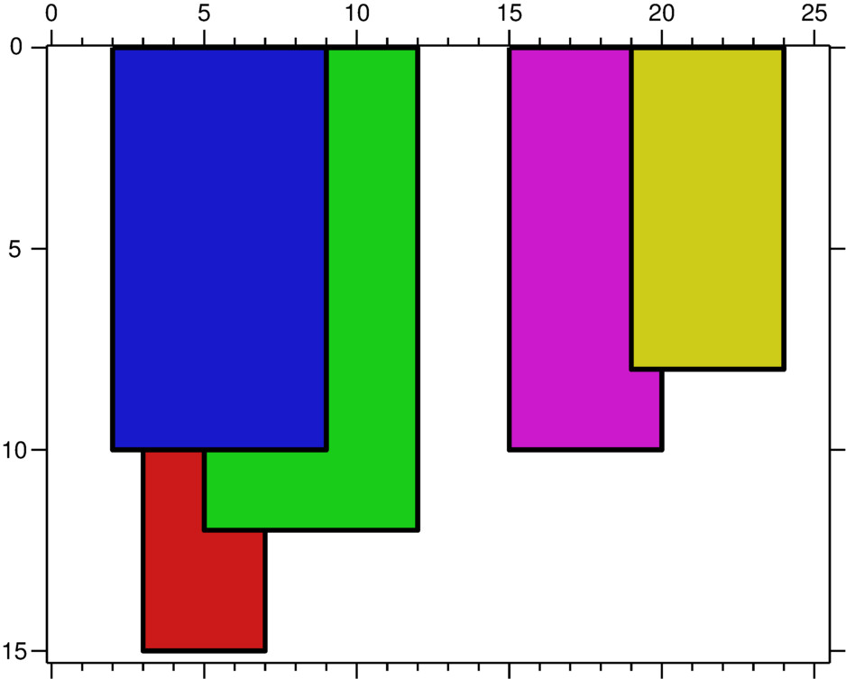
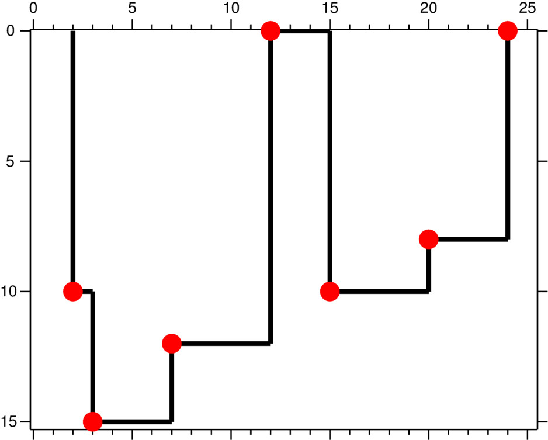

#### _Telerik Academy Season 2016-2017 Autumn / Data Structures and Algorithms Exam - 4 September 2017_
# Carpets

## Description

Steve loves his carpets to be clean. That is way he often washes them. After that he hangs them to dry.

You can notice that some of his carpets overlap. But Steve does not care if that makes them dry slower, he cares about the shape they make.

Each carpet has rectangular shape and will be described by `3` numbers (**L**, **R**, **H**):
  - It is hanged from **L** to **R** on the `X-axis`
  - Has height **H**

_Example (first sample input):_


A key point is defined as the left endpoint of a horizontal line segment.
The figure of carpets can be uniquely described by the red **key points** as shown below (notice the height of the rightmost point is `0`):


Write a program which by given **N** carpets finds all key points.
_Notes:_
  - Key points should be sorted by their `X-axis` in ascending order
  - No two **consecutive** key points should have the same `X` or `Y` values

## Input
- Input is read from the console
  - A number **N** is read from the first line
  - Each of the next **N** lines contains three numbers
    - describing a carpet
	- numbers will be separated by spaces

## Output
- Output should be printed on the console
  - Output each key point on a separate line in the specified order
    - separate `X` and `Y` by a single space

## Constraints
- 1 <= **N** <= 10 000
- For each carpet:
  - **L** < **R**
  - 1 <= **L**, **R**, **H** <= 1 000 000 000
- **See BGcoder for time and memory limits**

## Sample tests

### Sample test 1

#### Input
```
5
2 9 10
3 7 15
5 12 12
15 20 10
19 24 8
```

#### Output
```
2 10
3 15
7 12
12 0
15 10
20 8
24 0
```

### Sample test 2

#### Input
```
2
1 6 4
6 8 4
```

#### Output
```
1 4
8 0
```
