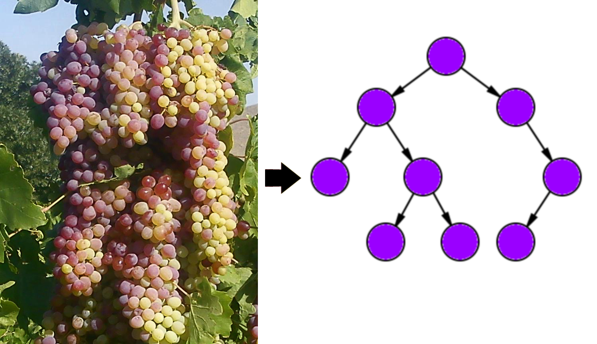

#### _Telerik Academy Season 2016-2017 Autumn / Data Structures and Algorithms Exam - 5 September 2017_
# Grapes

## Description

Steve has reached a conclusion. He needs to eat more fruit. But what type of fruit does he like? He makes his own genetically modified grape which looked more like binary trees (see picture below).



His grapes are somewhat limited, so he calls them \*rapes.
**N**-rape fruit is genetically modified grape with **N** amount of \*rapes.

Write a program which find the number of possible **N**-rape fruit configurations for a given value of **N**.

## Input
- Input is read from the console
  - A number **N** is read from the first line

## Output
- Output should be printed on the console
  - Print the answer on a single line

## Constraints
- 0 <= **N** <= 1000
- **See BGcoder for time and memory limits**

## Sample tests

### Sample test 1

#### Input
```
1
```

#### Output
```
1
```

### Sample test 2

#### Input
```
2
```

#### Output
```
2
```

### Sample test 3

#### Input
```
3
```

#### Output
```
5
```

### Sample test 4

#### Input
```
4
```

#### Output
```
14
```

### Sample test 5

#### Input
```
42
```

#### Output
```
39044429911904443959240
```
