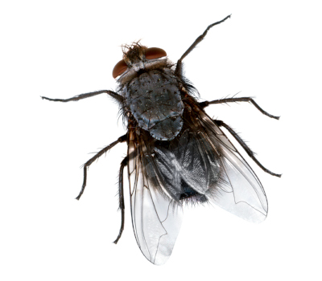

#### _Telerik Academy Season 2016-2017 Autumn / Data Structures and Algorithms Exam - 5 September 2017_
# Flies

## Description

Steve hates flies. He wants to kill them all. Currently there are **three flies** in the same room as him. Each one has `X` and `Y` coordinates (Steve lives in 2D space).

  

This is the perfect opportunity for Steve to test his new weapon. His weapon can shoot `3` beams in `3` different directions from his position.
His goal is to hit all `3` flies at the same time. In order to do that he has to stand at a position which is equally far from each fly. Write a program which finds that point.

_NOTE_: It is guaranteed that there will be **exactly** one point.

## Input
- Input is read from the console
  - The first line contains `X` and `Y` coordinates of the first fly
    - Separated by a space
  - The second line contains the coordinates of the second fly
  - The third line contains the coordinates of the third fly

## Output
- Output should be printed on the console
  - Output the `X` and `Y` coordinates where Steve should stand on single line
    - Separate them by a space
	- Use `4` digits of precision

## Constraints
- -1000000 <= `X` and `Y` coordinates of flies <= 1000000
- **See BGcoder for time and memory limits**

## Sample tests

### Sample test 1

#### Input
```
0 0
6 0
6 8
```

#### Output
```
3.0000 4.0000
```

### Sample test 2

#### Input
```
-3 0
3 0
0 3
```

#### Output
```
0.0000 0.0000
```

### Sample test 3

#### Input
```
4 2
-3 7
0 9
```

#### Output
```
0.6724 4.7414
```

  
